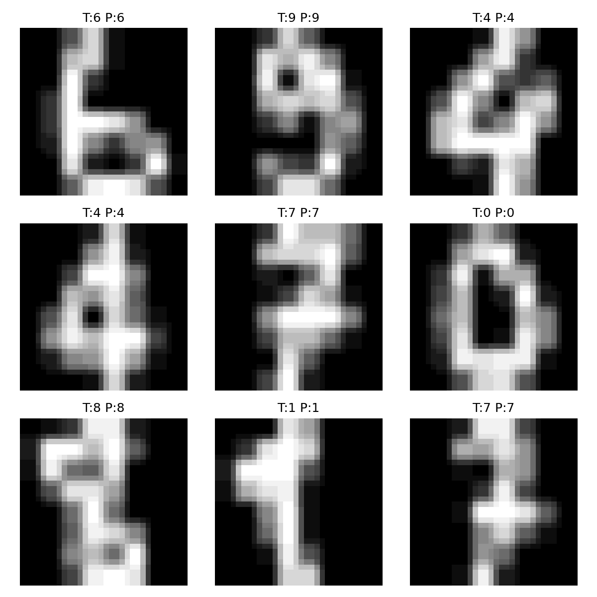
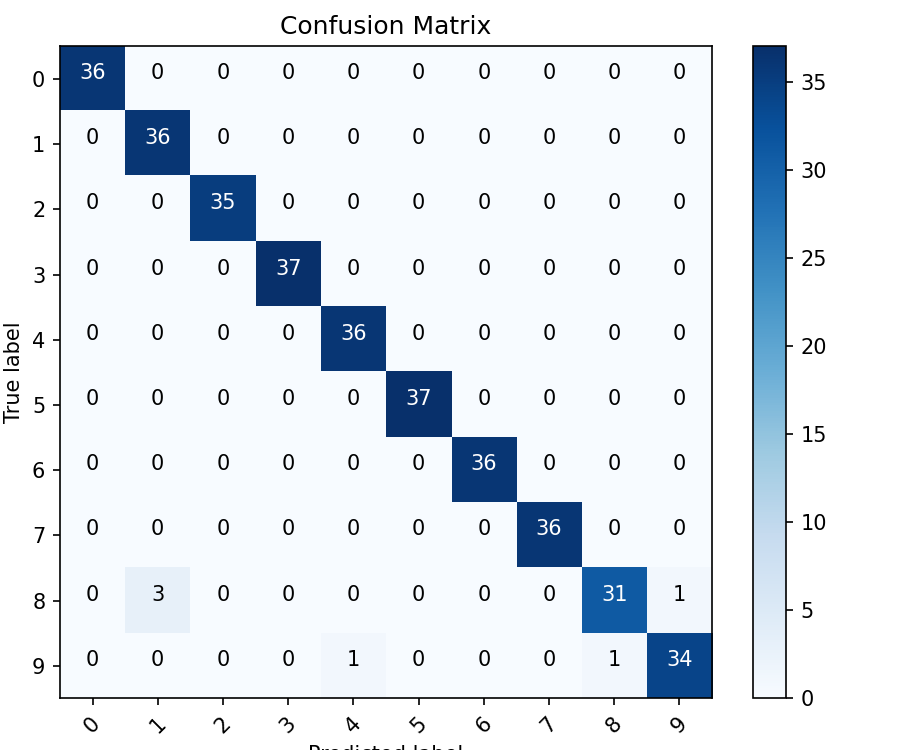
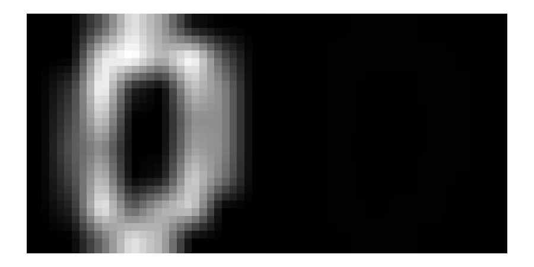

# Simple Image Classification & Image Processing using OpenCV

<p align="center">
  
</p>

---

## Project Overview

This project demonstrates a complete beginner-friendly Image Classification System built using:

- OpenCV for image preprocessing
- Machine Learning (k-Nearest Neighbors)
- Visualization using Matplotlib
- Handwritten Digit Classification using the Scikit-learn Digits Dataset

The project explores essential computer vision techniques including:

- Image resizing
- Grayscale conversion
- Brightness & contrast enhancement
- Gaussian blur filtering
- Image normalization
- Classification & evaluation

---

# Features

- Image preprocessing with OpenCV  
- Brightness & contrast enhancement  
- Gaussian blur filtering  
- Image normalization  
- k-NN classification model  
- Confusion matrix visualization  
- Prediction visualization  
- Side-by-side image enhancement comparison  
- Clean modular project structure  

---

# Technologies Used

| Technology | Purpose |
|------------|---------|
| Python | Programming Language |
| OpenCV | Image Processing |
| NumPy | Numerical Operations |
| Matplotlib | Data Visualization |
| Scikit-learn | Machine Learning |

---

# Project Structure

```bash
cv-1/
│
├── outputs/
│   ├── comparison_0.png
│   ├── confusion_matrix.png
│   └── predictions.png
│
├── utils/
│   ├── data_loader.py
│   ├── preprocess.py
│   ├── model.py
│   └── visualize.py
│
├── main.py
├── requirements.txt
└── README.md
```

---

# Dataset Used

This project uses the Scikit-learn Digits Dataset.

- 1797 grayscale handwritten digit images
- Digits from 0–9
- Original image size: 8×8 pixels

Dataset Source:

https://scikit-learn.org/stable/modules/generated/sklearn.datasets.load_digits.html

---

# Image Processing Pipeline

The following preprocessing techniques were applied using OpenCV:

### Grayscale Conversion
Converts images into grayscale format for easier processing.

### Image Resizing
Images resized to 32×32 pixels.

### Brightness & Contrast Enhancement
Improves visibility and feature clarity.

### Gaussian Blur
Reduces noise and smoothens images.

### Pixel Normalization
Normalizes pixel values between 0 and 1.

---

# Machine Learning Model

This project uses:

## k-Nearest Neighbors (k-NN)

- Beginner-friendly classification algorithm
- Classifies digits based on nearest image neighbors

### Dataset Split
- Training: 80%
- Testing: 20%

---

# Results

## Accuracy Achieved

```bash
Accuracy: 98.33%
```

---

# Confusion Matrix

<p align="center">
  
</p>

---

# Prediction Visualization

<p align="center">
  
</p>

---

# Image Enhancement Comparison

<p align="center">
  
</p>

---

# How to Run the Project

## 1. Clone Repository

```bash
git clone YOUR_GITHUB_REPO_LINK
```

---

## 2. Navigate to Project Folder

```bash
cd cv-1
```

---

## 3. Install Dependencies

```bash
pip install -r requirements.txt
```

---

## 4. Run the Project

```bash
python main.py
```

---

# Requirements

```txt
opencv-python
numpy
matplotlib
scikit-learn
```


# Learning Outcomes

Through this project, I learned:

- Basics of computer vision with OpenCV
- Image preprocessing techniques
- Machine learning classification workflow
- Data visualization techniques
- Modular Python project structure


